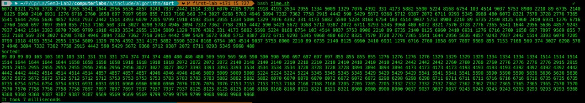

# Compile-Time Template Sort in C++
> This project demonstrates the implementation of bubble sorting at the compilation stage on templates in C++.

## Build & Compile

```
g++ -std=c++20 -O2 -o bubble_sort main.cpp
./bubble_sort
```

## Individuality
C++20 fold expressions and constexpr calls are used.
Sorting takes place at the compilation stage.
There is no use of dynamic memory or STL containers other than std::array.

It is limited by the depth of the compiler's recursion and the maximum number of template parameters.

It is suitable for educational or metaprogramming tasks, but not for real-world use.


